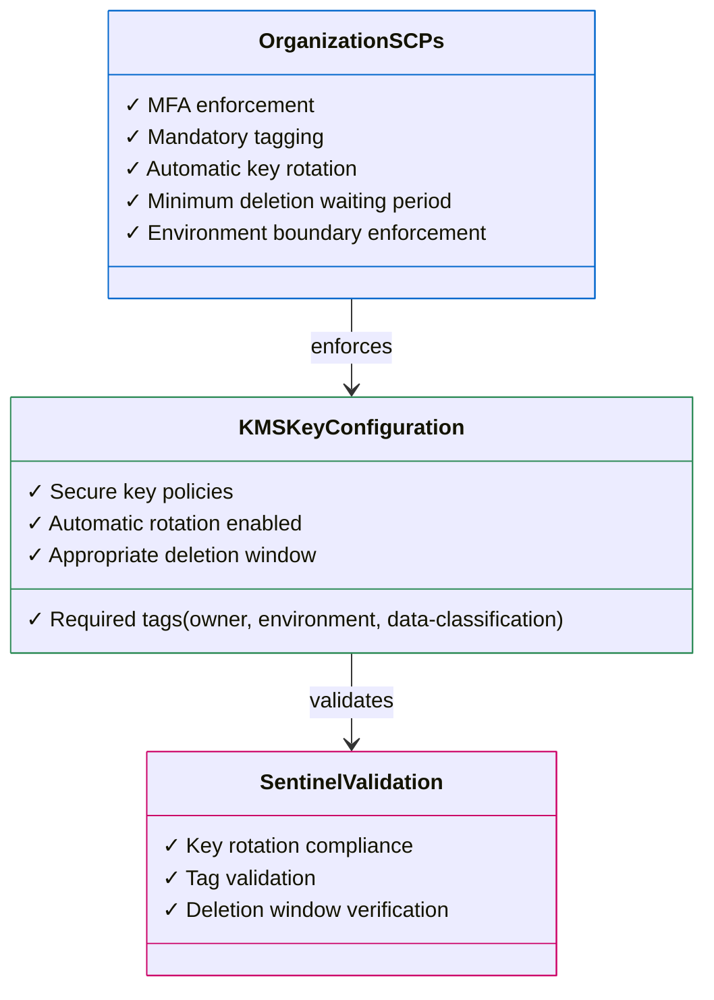

# AWS KMS Security Implementation

This module implements secure key management using AWS KMS with best practices for encryption, access control, and compliance.

## Overview

The AWS KMS implementation in this repository follows defense-in-depth principles through:

1. **Multi-layered security controls** at organization, account, and resource levels
2. **Environment-specific configurations** for dev and prod
3. **Policy enforcement** through AWS Organizations Service Control Policies (SCPs) and Resource Control Policies (RCPs)
4. **Sentinel policy validation** for secure key configurations

## Architecture



## Key Features

- **Environment Separation**: Keys in dev and prod environments are isolated through organization policies
- **MFA Enforcement**: Critical KMS operations require MFA
- **Required Tagging**: All keys must include `owner`, `environment`, and `data-classification` tags
- **Key Rotation**: Automatic key rotation is enforced
- **Deletion Protection**: 30-day minimum waiting period for key deletion
- **Access Boundaries**: Environment-specific access controls using OU-based restrictions

## Usage

### Basic Deployment

```hcl
# Initialize KMS module in dev environment
module "kms_keys" {
  source           = "../modules/kms_key"
  environment_name = "dev"
  key_function     = "sign"
  key_team         = "security"
  key_purpose      = "cmk"

  description = "KMS key for signing"

  custom_policy = "kms-key-policy.json"

  tags = {
    data-classification = "internal"
    owner               = "Security Operations"
    environment         = "dev"
  }
}
```

### Environment-Specific Configuration

The module supports different configurations for dev and prod environments:

- **Dev Environment**: Located in `kms/env/dev/`
  - Less restrictive deletion window
  - Development-specific access controls

- **Production Environment**: Located in `kms/env/prod/`
  - Extended deletion window
  - Enhanced access restrictions
  - Additional admin role requirements

## Security Controls

### Organization Policies

The module leverages AWS Organizations policies that enforce:

1. **Service Control Policies (SCPs)**:
   - `RequireMFAForCriticalKMSActions` - MFA required for key creation, deletion, etc.
   - `DenyCreateKeyWithoutRequiredTags` - Enforces tag requirements
   - `PreventDisablingKeyRotation` - Prevents disabling key rotation
   - `EnforceKMSKeyWaitingPeriod` - Sets minimum deletion waiting period

2. **Resource Control Policies (RCPs)**:
   - `DenyAccidentalDeletionKMSKey` - Limits key deletion to authorized roles
   - `RCPEnforceIdentityPerimeter` - Prevents external access
   - `RCPEnforceConfusedDeputyProtection` - Prevents confused deputy attacks

### Key Policies

The default key policy (`kms-key-policy.json`) includes:

- Root account access for recovery
- Organization-bound service access for CloudWatch and SSM
- MFA enforcement for sensitive operations
- External account access prevention

## CI/CD Pipeline

The module includes GitHub Actions workflows that:

1. Run Terraform validation
2. Execute Sentinel policy checks
3. Apply changes only if all validations pass

See `.github/workflows/aws_kms_dev.yml` for implementation details.

## Prerequisites

- Terraform 1.10 or newer
- AWS Provider ~> 5.94
- AWS Organization with properly configured OUs for prod and dev
- IAM roles and permissions for deployment

## Best Practices

This implementation follows AWS security best practices:

- **Least privilege**: Keys are accessible only from their environment's OU
- **Defense in depth**: Multiple layers of policies at organization and resource levels
- **Tag-based governance**: Required tags for ownership, environment, and data classification
- **Automated validation**: Sentinel policies verify secure configuration

<!-- BEGIN_TF_DOCS -->
## Requirements

| Name      | Version |
| --------- | ------- |
| terraform | >= 1.10 |
| aws       | ~> 5.94 |

## Providers

| Name | Version |
| ---- | ------- |
| aws  | 5.97.0  |

## Modules

| Name      | Source             | Version |
| --------- | ------------------ | ------- |
| kms\_keys | ../modules/kms_key | n/a     |

## Resources

| Name                                                                                                                          | Type        |
| ----------------------------------------------------------------------------------------------------------------------------- | ----------- |
| [aws_caller_identity.current](https://registry.terraform.io/providers/hashicorp/aws/latest/docs/data-sources/caller_identity) | data source |

## Inputs

| Name                       | Description            | Type     | Default       | Required |
| -------------------------- | ---------------------- | -------- | ------------- | :------: |
| aws\_region                | AWS region             | `string` | `"us-east-1"` |    no    |
| custom\_policy             | Policy paths           | `any`    | n/a           |   yes    |
| deletion\_window\_in\_days | n/a                    | `any`    | n/a           |   yes    |
| description                | n/a                    | `any`    | n/a           |   yes    |
| enable\_key\_rotation      | KMS Policy Options     | `any`    | n/a           |   yes    |
| environment\_name          | n/a                    | `any`    | n/a           |   yes    |
| key\_function              | KMS Naming conventions | `any`    | n/a           |   yes    |
| key\_purpose               | n/a                    | `any`    | n/a           |   yes    |
| key\_team                  | n/a                    | `any`    | n/a           |   yes    |
| tags                       | n/a                    | `any`    | n/a           |   yes    |

## Outputs

| Name        | Description               |
| ----------- | ------------------------- |
| account\_id | The AWS account ID        |
| alias\_arn  | The ARN of the KMS alias  |
| alias\_name | The name of the KMS alias |
| environment | The current environment   |
| key\_arn    | The ARN of the KMS key    |
| key\_id     | The ID of the KMS key     |
<!-- END_TF_DOCS -->
